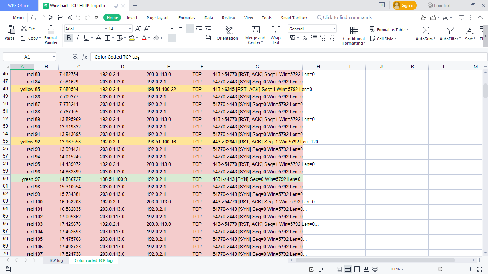
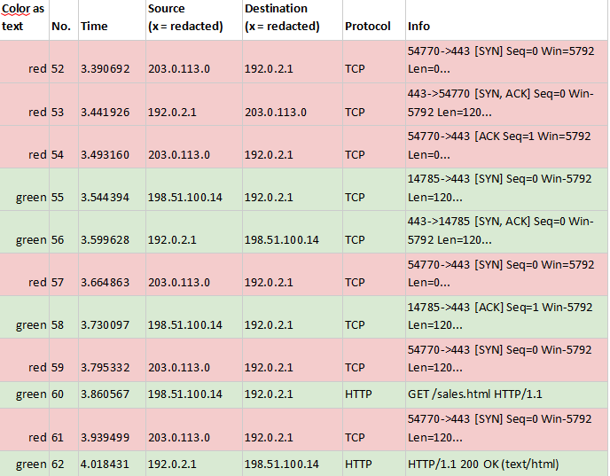

<h1>Identification of the type of attack</h1>

Upon analyzing the Wire shark log of HTTP and TCP traffic, it was observed that requests were being made via the transport layer protocol to initiate a TCP handshake from an unidentified IP address outside employee’s subnet address.  Although the IP address could potentially belong to a customer, the nature of the requests exhibited abnormal behaviour. Even after establishing a connection, the suspected IP address continued to send multiple SYN packets over TCP to the web server. These packets originated from a single source IP address and were numerous, indicating a classic SYN flood Denial of Service Attack.

  

 

  

Initially, the attacker’s SYN request is answered normally by the web server (log items 52-54). However, the attacker keeps sending more SYN requests, which is abnormal. At this point, the web server is still able to respond to normal visitor traffic, which is highlighted and labeled as green. An employee visitor with the IP address of 198.51.100.14 successfully completes a SYN/ACK connection handshake with the webserver (log item nos. 55, 56, 58). Then, the employee’s browser requests the sales.html webpage with the GET command and the web server responds (log item no. 60 and 62).
 
 
In the next 20 rows, the log begins to reflect the struggle the web server is having to keep up with the abnormal number of SYN requests coming in at a rapid pace. The attacker is sending several SYN requests every second. The rows highlighted and labeled yellow are failed communications between legitimate employee website visitors and the web server.
 
 
<h1>The two types of errors in the logs include :</h1> 

 1.   An HTTP/1.1 504 Gateway Time-out (text/html) error message. This message is generated by a gateway server that was waiting for a response from the web server. If the web server takes too long to respond, the gateway server will send a timeout error message to the requesting browser.

 

 2.   An [RST, ACK] packet, which would be sent to the requesting visitor if the [SYN, ACK] packet is not received by the web server. RST stands for reset, acknowledge. The visitor will receive a timeout error message in their browser and the connection attempt is dropped. The visitor can refresh their browser to attempt to send a new SYN request.

 
 

As you scroll through the rest of the log, you will notice the web server stops responding to  legitimate employee visitor traffic. The visitors receive more error messages indicating that they cannot establish or maintain a connection to the web server. From log item number 125 on, the web server stops responding. The only items logged at that point are from the attack. As there is only one IP address attacking the web server, you can assume this is a direct DoS SYN flood attack.

DNS AND ICMP TCPDUMP LOG DATA

13:24:32.192571 IP 192.51.100.15.52444 > 203.0.113.2.domain: 35084+ A? yummyrecipesforme.com. (24)

13:24:36.098564 IP 203.0.113.2 > 192.51.100.15: ICMP 203.0.113.2 
udp port 53 unreachable length 254

13:26:32.192571 IP 192.51.100.15.52444 > 203.0.113.2.domain: 35084+ A? yummyrecipesforme.com. (24)

13:27:15.934126 IP 203.0.113.2 > 192.51.100.15: ICMP 203.0.113.2 
udp port 53 unreachable length 320

13:28:32.192571 IP 192.51.100.15.52444 > 203.0.113.2.domain: 35084+ A? yummyrecipesforme.com. (24)

13:28:50.022967 IP 203.0.113.2 > 192.51.100.15: ICMP 203.0.113.2 
udp port 53 unreachable length 150

   

